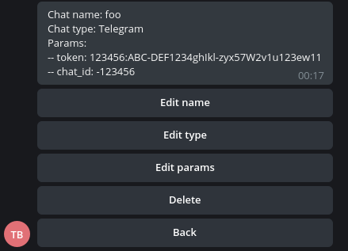
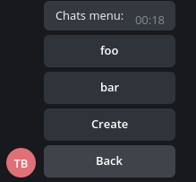
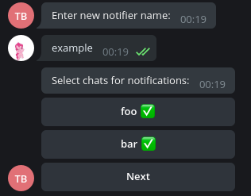
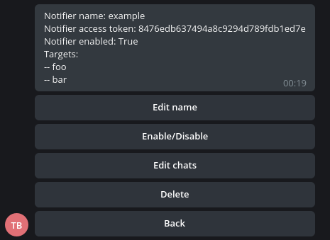

# 📢✉️ Achtung

Achtung is a modular, extensible multi-notifier that makes it easy to manage multiple notifications from all the tools you need.

## Content

1. [Screenshots](#screenshots)
2. [Installation](#installation)
    1. [Configuration](#configuration)
        1. [Catcher](#catcher)
        2. [Telegram admin panel](#telegram-admin-panel)
        3. [docker-compose.yml](#docker-composeyml)
    2. [Launch](#launch)
3. [Usage](#usage)
4. [Develop new senders](#develop-new-senders)

## Screenshots

|  |  |
|--|--|
|  |  |

## Installation

### Configuration

#### Catcher

1. Generate random password for communicating with API and put it into .env file:

```env
ADMIN_PASS=R3411yR4nd0m+P455w0rd
```

#### Telegram admin panel

1. Register a bot for Telegram admin panel: @BotFather.

2. Enter your Telegram bot API token into .env file:

```env
API_TOKEN=**YOUR_TELEGRAM_BOT_API_TOKEN**
```

3. Put comma-separated admin IDs into .env file:

```env
ADMIN_ID=**FIRST_ADMIN_TG_ID**,**ANOTHER_ADMIN_TG_ID**
```

4. **If you want to use webhooks**, put your HOST machine address/domain into .env file:

```env
WEBHOOK_HOST=https://achtung.example.com
```

**If you don't want use webhooks**, edit [./telegram-admin/Dockerfile](telegram-admin/Dockerfile): comment 9 line and uncomment 10 line

#### docker-compose.yml

1. Replace services.nginx.ports in docker-compose.yml with IP and PORT you need:

```yml
ports:
    - "0.0.0.0:1337:8080"
```

Remember, the last 8080 is required.

### Launch

1. Install docker and docker-compose.yml:

* https://docs.docker.com/engine/install/

* https://docs.docker.com/compose/install/

2. Run:

```bash
docker-compose up -d
```

## Usage

1. Register bots to send notifications.

2. Invite bots for notifications to the chats/dialogs.

3. Create CHATS using admin panel or raw API.

4. Create NOTIFIER and select CHATS you want using admin panel or raw API.

5. Send notifications using your NOTIFIER's token:

```bash
curl 'https://achtung.example.com/api/notify' -d '{"access_token":"TOKEN_HERE", "message":"NOTIFICATIONS_HERE"}'
```

## Develop new senders

Sender is a class for sending notifications. Let's develop Sender for Telegram.

1. Copy a sender-template:

```python
from aiohttp import ClientSession

from senders.base import Sender


class NewSender(Sender):
    required_fields = {
        'first_field': 'description of the first field',
        'second_field': 'description of the second field'
    }

    def __init__(self, **kwargs):
        super().__init__(**kwargs)
        self.url = ('https://api.example.com/{token}/send'
                    .format(token=self.config['first_field']))

    async def send(self, message):
        async with ClientSession() as session:
            await session.post(
                self.url,
                params={
                    'chat_id': self.config['second_field'],
                    'text': message
                }
            )

```

2. Let's fill in the required fields:

```python
required_fields = {
    'token': 'Telegram Bot API token',
    'chat_id': 'chat id where notifications will be sent'
}
```

You can get keys (token, chat_id) from `self.config['KEY']`.</br>
The description is required to form a request for the user to enter a specific parameter: `Please, enter {DESCRIPTION}`.

3. In `__init__(self, **kwargs)` you can create additional variables (e.g. `self.url`):

```python
def __init__(self, **kwargs):
    super().__init__(**kwargs)
    self.url = ('https://api.telegram.org/bot{token}/sendMessage'
                .format(token=self.config['token']))
```

4. `send(self, message)`  method is for sending a notification (a `message` variable). Here you need to determine the logic of sending a request to the bot API:

```python
async def send(self, message):
    async with ClientSession() as session:
        await session.post(
            self.url,
            params={
                'chat_id': self.config['chat_id'],
                'text': message,
                'parse_mode': 'html'
            }
        )
```

5. In the end you need to import your Sender class in `catcher/app/senders/senders.py` and add it to `mapper`:

```python
from senders.telegram import Telegram

...

mapper['Telegram'] = Telegram
```
